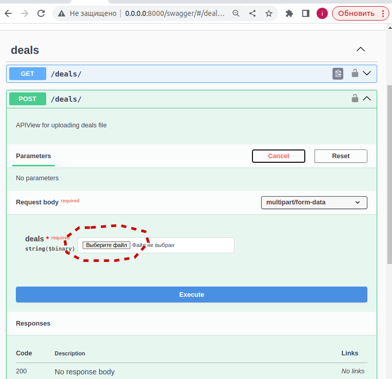

# Бэкэнд-api, извлечения из csv файла данных о клиентах с наибольшей затратой при покупке драгоценных каменй

## Описание:  
Веб-сервис для:

1. Принятия из POST-запроса .csv файла для дальнейшей обработки;
2. Обрабатывнаия типовых deals.csv файлов, содержащих истории сделок;
3. Сохранения извлеченных из файла данные в БД проекта;
4. Возвращения обработанных данные в ответе на GET-запрос.

Эндпоинты:  

1) GET запрос на uri /deals/:  
Возвращает список из 5 клиентов, потративших наибольшую сумму за весь период.   

    Каждый клиент описывается следующими полями:
* username - логин клиента;
* spent_money - сумма потраченных средств за весь период;
* gems - список из названий камней, которые купили как минимум двое из списка "5 клиентов, потративших наибольшую сумму за весь период", и данный клиент является одним из этих покупателей.
  
2) POST запрос на uri /deals/:  
Аргументы:
* deals: файл, содержащий историю сделок.

    Ответ:
* Status: OK - файл был обработан без ошибок;
* Status: Error, Desc: <Описание ошибки> - в процессе обработки файла произошла ошибка.

Дополнительно:
- имеется кэширование GET запросов
- запуска через docker compose up
- используется gunicorn для многопоточности
- API реализован на основе  DRF

##  Запуск
### команда на линукс:
    docker compose up 
### команда на windows:
    docker-compose up
(!!!! перед запуском на windows необходимо в папке docker у файла entrypoint.sh преобразовать окончания строк с CRLF на LF на любом текстовом редакторе)

Пример csv файла есть в папке с проектом
### Cтраница Swagger:
[http://localhost:8000/swagger](http://localhost:8000/swagger)

Пример работы

  

*Ответ от сервиса при GET запросе на uri /deals/*

  

